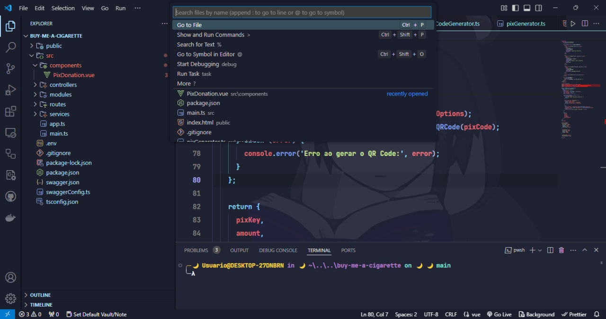

<h1 align="center">
  <br>
  <a href="https://marketplace.visualstudio.com/items?itemName=BrunoCiccarino.nekonight">
    
  </a>
  <br>
  Nekonight
  <br>
</h1>

<p align="center">
  <a href="https://marketplace.visualstudio.com/items?itemName=BrunoCiccarino.nekonight">
    
  </a>
  <a href="https://marketplace.visualstudio.com/items?itemName=BrunoCiccarino.nekonight">
    
  </a>
  <a href="https://marketplace.visualstudio.com/items?itemName=BrunoCiccarino.nekonight">
    
  </a>
</p>

Looking for a theme that fits your vibe? Whether you're into dark mode, light mode, or something in between, this NekoNight has got you covered. Written for snappy performance, it's a buffet of color schemes for every taste and mood. 🍭 Want to boost your productivity and look good while coding? We've got countless options to keep you inspired and in the zone. 🚀✨ If you love it (and we know you will), hit that ⭐ on our official repo. Your support means the world! 🌍

### 🌍 Variants

- nekonight 
- nekonight-storm
- nekonight-deep-ocean
- nekonight-moon
- nekonight-aurora
- nekonight-day
- nekonight-sky-blue
- nekonight-sexy

### 🚀 Nekonight 

<table width="100%">
  <tr>
    <td width="50%">
      
    </td>
    <td width="50%">
      
    </td>
    </tr>
    <tr>
    <td width="50%">
      
    </td>
    <td width="50%">
      
    </td>
    </tr>
    <tr>
    <td width="50%">
      
    </td>
    <td width="50%">
      
    </td>
    </tr>
        <tr>
    <td width="50%">
      
    </td>
    <td width="50%">
      
    </td>
    </tr>
    <tr>
    <td width="50%">
      
    </td>
    <td width="50%">
      
    </td>
    </tr>
      <tr>
    <td width="50%">
      
    </td>
    <td width="50%">
      
    </td>
    </tr>
    <tr>
    <td width="50%">
      
    </td>
    <td width="50%">
      
    </td>
    </tr>
        <tr>
    <td width="50%">
      
    </td>
    <td width="50%">
      
    </td>
    </tr>
    <tr>
    <td width="50%">
      
    </td>
    <td width="50%">
      
    </td>
    </tr>
        <tr>
    <td width="50%">
      
    </td>
    <td width="50%">
      
    </td>
    </tr>
        <tr>
    <td width="50%">
      
    </td>
    <td width="50%">
      
    </td>
    </tr>
        <tr>
    <td width="50%">
      
    </td>
    <td width="50%">
      
    </td>
    </tr>
    <tr>
    <td width="50%">
      
    </td>
    <td width="50%">
      
    </td>
    </tr>
        <tr>
    <td width="50%">
      
    </td>
    <td width="50%">
      
    </td>
    </tr>
    <tr>
    <td width="50%">
      
    </td>
    <td width="50%">
      
    </td>
    </tr>
        <tr>
    <td width="50%">
      
    </td>
    <td width="50%">
      
    </td>
    </tr>
    <tr>
    <td width="50%">
      
    </td>
    <td width="50%">
      
    </td>
    </tr>
        <tr>
    <td width="50%">
      
    </td>
    <td width="50%">
      
    </td>
    </tr>
</table>

### ⚙️ Suggested configuration

```json
// Theme Setup.
"workbench.colorTheme": "nekonight",
"workbench.iconTheme": "vscode-icons",
"editor.fontFamily": "Menlo, Monaco, 'Courier New', monospace",
"terminal.integrated.fontFamily": "'Inconsolata for Powerline', monospace",
"editor.fontSize": 17,
"editor.lineHeight": 24.65,
"editor.letterSpacing": 0.5,
"editor.fontWeight": "400",
"editor.fontLigatures": true,
"editor.cursorStyle": "line",
"editor.cursorWidth": 5,
"editor.cursorBlinking": "solid",
"editor.renderWhitespace": "all",
"editor.snippetSuggestions": "top",
"workbench.startupEditor": "newUntitledFile",
"editor.glyphMargin": true,
"workbench.editor.enablePreview": false,
"explorer.confirmDragAndDrop": false,
"files.trimTrailingWhitespace": true,
"files.trimFinalNewlines": true,
// Formatting Optional.
"editor.formatOnSave": true,
"prettier.eslintIntegration": true,
"eslint.run": "onType",
"editor.codeActionsOnSave": {
    "source.fixAll.eslint": true
},
// MacOS Only Settings.
"workbench.fontAliasing": "auto",
"terminal.integrated.macOptionIsMeta": true,
"workbench.statusBar.feedback.visible": false,
"editor.semanticHighlighting.enabled": false,

"highlight-matching-tag.styles": {
    "opening": {
        "full": {
            "highlight": "rgba(165, 153, 233, 0.3)"
        }
    }
},
```
### 🔥 Contributing

Pull requests are welcome.

That said, there's a bunch of ways you can contribute to this project, like by:

* ⭐ Giving a star on this repository (this is very important and costs nothing)
* 🪲 Reporting a bug
* 📄 Improving this [documentation](./doc/nekonight.md)
* 🚨 Sharing this project and recommending it to your friends
* 💻 Submitting a pull request to the official repository

### ✨ Tasks

- [ ] adding an documentation
- [ ] Start creating the other themes in the pack
- [ ] Add syntax highlighting for less used languages ​​in vscode like scala, lisp, haskell, etc...
  

### 👏 Acknowledgements 

- [Visual Studio Code TokyoNight](https://github.com/enkia/tokyo-night-vscode-theme)
- [tokyonight.nvim](https://github.com/folke/tokyonight.nvim)
- [jetbrains material theme](https://github.com/ChrisRM/material-theme-jetbrains)
  
<p align="center">Copyright © 2024 Bruno Ciccarino</p>